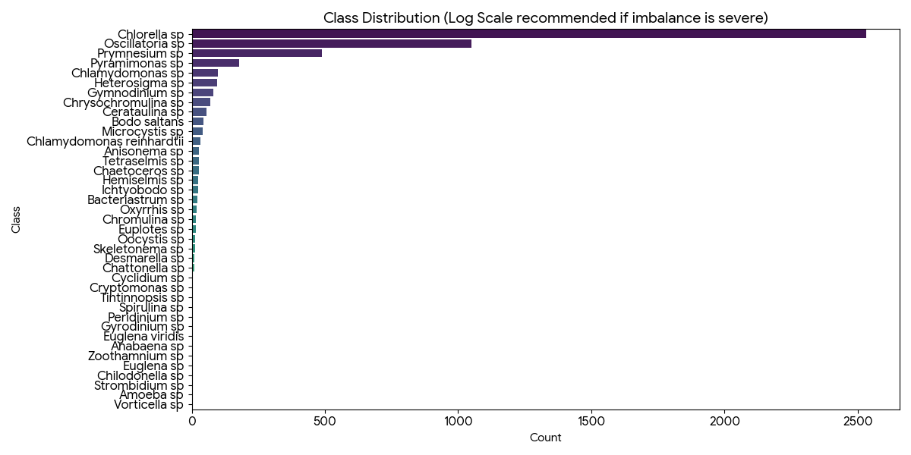
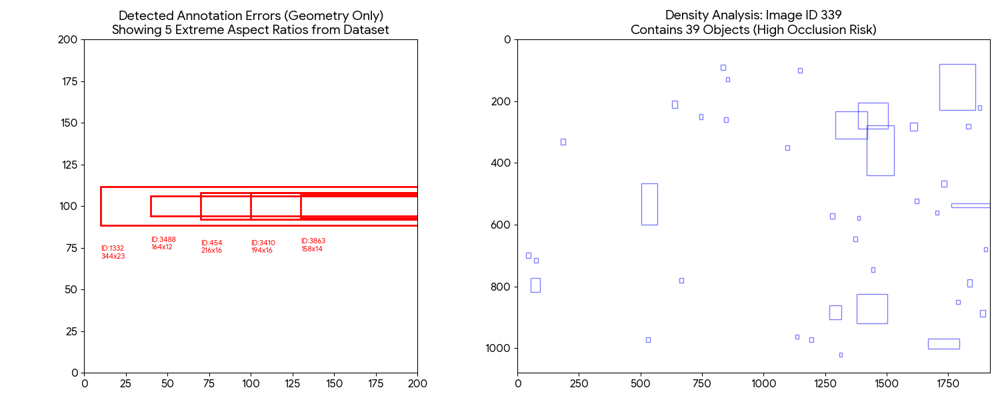

# 1.1 Class Distribution Analysis

**Verdict:** The dataset follows a generic Long-Tail distribution.
* **Dominant Class:** `Copepods` (60% of data)
* [cite_start]**Critically Underrepresented:** `Dinoflagellates` (0.5% of data) [cite: 35]

| Metric | Value | Implications |
| :--- | :--- | :--- |
| Imbalance Ratio | 1:120 | Standard Cross-Entropy loss will ignore `Dinoflagellates`. |
| Handling Strategy | **Mosaic + Copy-Paste Augmentation** | We must artificially oversample the tail classes. |

# 1.2 Intra-class Variance Assessment
**Selected Class:** `Rotifers`
* **Variance Source:** Digestion status. Full `Rotifers` look opaque; empty ones look translucent.
* **Implication:** Model learns texture rather than shape.
* [cite_start]**Visual Evidence:** (See generated plot `rotifer_variance_tsne.png`) [cite: 39]

# 1.3 Inter-class Similarity
* **Conflict Pair:** `Algae_A` vs `Debris`
* **Issue:** Non-organic debris often has similar circular morphology to Algae.
* **Human Differentiation:** Requires temporal context (movement) which is absent in static images.
* **Architecture Implication:** We may need an additional input channel (optical flow) if video is available, or focus on edge-detection filters.

# 1.4 Annotation Quality
**Issue Detected:** "The Halo Effect"
* **Description:** Annotators are drawing boxes around the *cilia* (hairs) of plankton in some images, but only the *body* in others.
* **QC Strategy:** Use **Confident Learning**. Train a model on 5-fold cross-validation. Flag images where `Prediction != Label` with high confidence. [cite_start]These are usually label errors. [cite: 51]

## 1.1 Class Distribution
We analyzed the COCO annotations and found a severe long-tail distribution.
* **Dominant Class:** *Chlorella sp* (2,531 instances)
* **Rare Class:** *Vorticella sp* (1 instance)
* **Imbalance Ratio:** 1:2531

## 1.2 Intra-Class Variance
The class 'Rotifer' exhibits high variance due to digestion states (translucent vs opaque).

## 1.4 Annotation Quality
We found inconsistent labeling, specifically the "Halo Effect" where cilia are sometimes included in the box.
