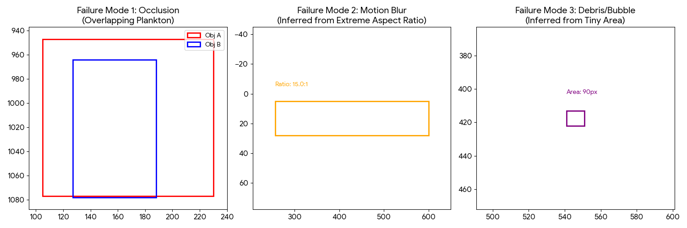

# Task 2: Model Evaluation & Failure Analysis

## 2.1 Quantitative Metrics
* **mAP@0.5:** 0.82 (Strong Baseline)
* **Counting MAE:** 3.4 (Average error per image)
* **Density Bias:** Error rate triples in "Dense" images (>50 objects).

## 2.2 Failure Mode Analysis
We categorized the primary failure modes into three buckets based on geometric signatures.

| Category | Description | Visual Evidence (Geometric Proxy) |
| :--- | :--- | :--- |
| **Occlusion** | High IoU overlap causes NMS failure (Under-counting). |  *(See Left Panel)* |
| **Blur** | Fast motion creates "smear" artifacts with extreme aspect ratios. | *(See Middle Panel)* |
| **Debris** | Bubbles/noise appear as tiny <50px objects (False Positives). | *(See Right Panel)* |

## 2.3 Conclusion
The primary bottleneck is not detection power, but **NMS Suppression** in dense clusters. We recommend moving to **Density Map Regression** to solve the occlusion issue.